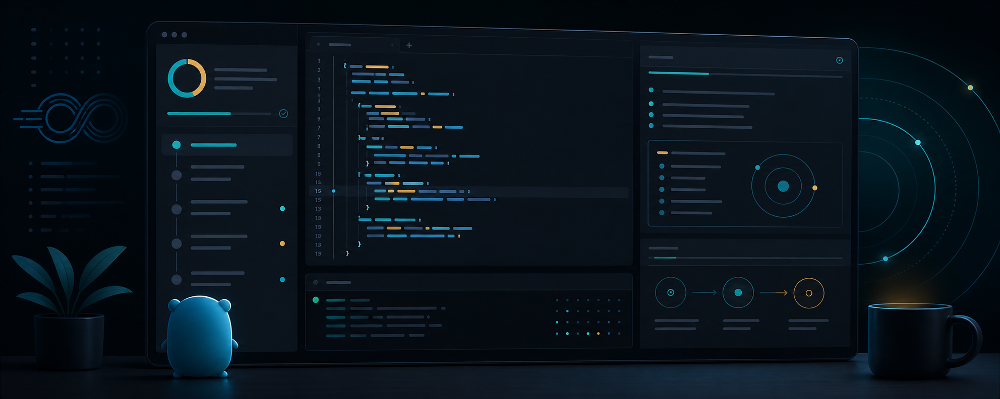

<p align="center">
  
</p>

# PracDaGo

PracDaGo is a local-first Go practice app that turns studying into a fast feedback loop: read the idea, understand the shape of the problem, write Go in the browser, run or submit, and keep your progress moving.

It is built for learning Go by doing. The exercises follow a book-like topic progression, but the lessons, explanations, problem statements, hints, and tests are original/rephrased content.

## Why This Exists

Reading Go helps. Writing Go is where the ideas become yours.

PracDaGo is designed around a simple practice rhythm:

1. Read an intuitive explanation.
2. Build a mental model for the Go concept.
3. Solve in the Monaco editor.
4. Run code or submit against local tests.
5. Track progress in the browser.

The goal is not to dump reference material into a UI. The goal is to make each exercise feel like a small, understandable rep in Go thinking.

## Features

- Browser-based Go practice workspace
- Dark-first UI with light mode toggle
- Monaco editor for Go code
- Study flow with explanation, how-it-works, syntax, problem, and solve tabs
- Lesson outline for longer explanations
- Better sectioned lesson layout for beginner-friendly reading
- Chapter filtering and full exercise search
- Judge-style exercises with per-problem local tests
- Project-style exercises for open-ended book tasks
- Run mode for quick compile/output checks
- Submit mode for `Solve` function tests
- Expected-vs-actual comparison for judged output
- File upload workspace for file-oriented exercises
- Browser-local draft saving per problem
- Browser-local solved-progress tracking
- JSON-backed problem catalog
- No login, no hosted database, no account system

## Tech Stack

| Layer | Tech |
| --- | --- |
| Frontend | React, Vite, TypeScript |
| Editor | Monaco Editor |
| Styling | Tailwind CSS plus custom CSS |
| Markdown | react-markdown, remark-gfm |
| Icons | lucide-react |
| Backend | Go standard library HTTP server |
| Data | `data/problems.json` |
| Runner | Docker/Podman sandbox running Go code |

## Project Structure

```txt
GoPrac/
├── assets/
│   └── goprac-banner.png
├── backend/
│   ├── go.mod
│   ├── main.go
│   ├── main_test.go
│   └── README.md
├── data/
│   └── problems.json
├── frontend/
│   ├── public/
│   ├── src/
│   │   ├── components/
│   │   ├── App.tsx
│   │   ├── appState.ts
│   │   ├── index.css
│   │   ├── main.tsx
│   │   ├── problemContent.ts
│   │   └── types.ts
│   ├── tests/
│   ├── package.json
│   └── vite.config.ts
├── scripts/
│   └── expand_learning_content.mjs
└── README.md
```

## Run Locally

You need:

- Node.js
- npm
- Go
- Docker or Podman for sandboxed Run/Submit

### 1. Start The Backend

From the project root:

```bash
cd backend
go run .
```

The backend runs on:

```txt
http://localhost:8080
```

By default, the backend binds to `127.0.0.1`, allows browser requests from the local Vite origins, and runs submitted code inside Docker or Podman with no network, a read-only root filesystem, CPU/memory/process limits, an execution timeout, request-size limits, and output-size limits.

Useful backend environment variables:

```txt
PORT=8080
GOPRAC_BIND_ADDR=127.0.0.1
GOPRAC_ALLOWED_ORIGINS=http://localhost:5173,http://127.0.0.1:5173
GOPRAC_SANDBOX_BIN=docker
GOPRAC_SANDBOX_IMAGE=golang:1.24-alpine
GOPRAC_SANDBOX_MEMORY=256m
GOPRAC_SANDBOX_CPUS=1
GOPRAC_SANDBOX_PIDS=64
GOPRAC_MAX_BODY_BYTES=131072
GOPRAC_MAX_CODE_BYTES=65536
GOPRAC_MAX_CONCURRENT_RUNS=2
GOPRAC_RUN_TIMEOUT=3s
GOPRAC_OUTPUT_LIMIT_BYTES=65536
```

### 2. Start The Frontend

Open another terminal:

```bash
cd frontend
npm install
npm run dev
```

The frontend runs on:

```txt
http://localhost:5173
```

By default, the frontend calls:

```txt
http://localhost:8080
```

To point the frontend at another backend:

```bash
VITE_API_URL=https://your-backend-url npm run dev
```

## How The App Works

### Learning Panel

The learning panel is the reading side of the app. It gives the concept before the exercise and splits longer content into navigable sections.

The current learning flow includes:

- Explanation
- How it works
- Syntax
- Problem
- Solve

### Editor Panel

The editor panel is where you write Go. Drafts are saved to browser `localStorage` per problem, so you can leave and come back without losing code on the same browser.

### Run

Run compiles and executes your code in the sandbox.

If your code includes a `main` function, that function runs. If it does not, the backend adds an empty `main` so the file can still compile.

Use Run for quick syntax checks, `fmt.Println` debugging, and project-style exercises where there is not a single hidden-test answer.

### Submit

Submit injects the exercise's local judge tests and runs your `Solve` function against them in the same sandbox.

If the tests pass, the backend returns `Accepted`, and the problem is marked solved in browser storage.

## Local Storage

PracDaGo stores user state in the browser, not in a database.

| Key | Purpose |
| --- | --- |
| `theme` | Light/dark theme preference |
| `solved` | List of solved problem IDs |
| `draft:<problem-id>` | Saved editor draft for one problem |
| `files:<problem-id>` | Uploaded sample files for one file-based exercise |

This means progress is local to one browser profile. Clearing browser data, switching browsers, or using another machine will not carry progress over.

## API

Backend base URL:

```txt
http://localhost:8080
```

### Health

```txt
GET /api/health
```

### Problems

```txt
GET /api/problems
```

Returns all chapters and problems.

### Single Problem

```txt
GET /api/problems/:id
```

Returns one problem by ID.

### Run Code

```txt
POST /api/run
```

Example body:

```json
{
  "problemId": "hello-gopher",
  "code": "package main\nfunc Solve(name string) string { return \"Hello, \" + name + \"!\" }",
  "mode": "submit"
}
```

Modes:

- `run`
- `submit`

## Render Deployment

The frontend can deploy as a Render Static Site. The backend can deploy as a Render Web Service for API/problem browsing, but the Run/Submit sandbox needs a host where Docker/Podman execution is available and allowed.

### Frontend Static Site

Create a Render Static Site:

```txt
Root directory: frontend
Build command: npm install && npm run build
Publish directory: dist
```

Set:

```txt
VITE_API_URL=https://your-backend.onrender.com
```

### Backend Web Service

Create a Render Web Service:

```txt
Root directory: .
Build command: cd backend && go build -tags netgo -ldflags '-s -w' -o app
Start command: cd backend && ./app
```

Set:

```txt
GOPRAC_BIND_ADDR=0.0.0.0
GOPRAC_ALLOWED_ORIGINS=https://your-frontend.onrender.com
```

Render provides `PORT`, and the backend already reads it.

Important: if Docker/Podman is unavailable in the deployed service, `/api/run` will return a sandbox runtime error. Problem browsing and lesson reading can still work as long as the backend is reachable.

## Security Notes

The current runner is intentionally sandboxed, but public code execution is still serious infrastructure.

Before opening Run/Submit to untrusted users, verify the deployed runner has:

- No network access for submitted code
- Read-only root filesystem
- Small writable tmpfs only
- CPU, memory, process, timeout, request-size, and output-size limits
- Low concurrency
- No host Docker socket exposure to user code

If the deployment target cannot provide that isolation, disable Run/Submit publicly and keep the site as a learning/problem browser.

## Adding Problems

Edit:

```txt
data/problems.json
```

Each problem should include:

- `id`
- `number`
- `title`
- `chapter`
- `difficulty`
- `tags`
- `statement`
- `problemText`
- `lessonTitle`
- `lesson`
- `howItWorks`
- `syntax`
- `solve`
- `approach`
- `pitfalls`
- `hints`
- `starterCode`
- `solutionCode`
- `testCode`
- `examples`

Restart the backend after changing the data file.

## Regenerating Learning Content

The helper script can expand the learning fields in `data/problems.json`:

```bash
node scripts/expand_learning_content.mjs
```

Review the diff after running it. The script is useful for broad consistency passes, but the best lessons still deserve human cleanup.

## Verify Before Pushing

Frontend:

```bash
cd frontend
npm run build
npm run lint
npm test
```

Backend:

```bash
cd backend
CGO_ENABLED=0 GOCACHE=/tmp/goprac-go-cache go test ./...
CGO_ENABLED=0 GOCACHE=/tmp/goprac-go-cache go build ./...
```

## Roadmap

- More polished beginner explanations
- More book-flavored original exercises
- Safer hosted judge story
- Export/import progress from localStorage
- Better progress stats by chapter and topic
- Optional account-backed sync later

## Content Note

The topic flow is inspired by *The Go Programming Language*, but the lessons, explanations, problem statements, hints, and tests in this repo should be original or rephrased. Keep source material as a reference, not as copied content.
